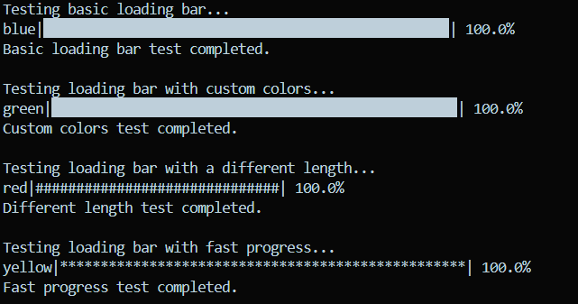

# LoadingBarCLI

A sleek, customizable, and colorful loading bar for Python command-line applications.



## 🚀 Installation

Install `loadingbarcli` via pip:

```bash
pip install loadingbarcli
```


## 📘 Usage

### Basic Example

Here’s how to integrate `LoadingBar` into your Python scripts:

```python
import time
from loadingbarcli import LoadingBar

# Initialize a loading bar with 100 steps
bar = LoadingBar(total=100, length=50, fill='█', color="blue")

# Simulate work
for i in range(101):
    time.sleep(0.05)
    bar.update(i)

bar.finish()  # Complete the loading bar
```

### 🌟 Advanced Customization

Customize the bar’s color, length, and fill characters:

```python
import time
from loadingbarcli import LoadingBar

# Custom color and style
bar = LoadingBar(total=100, length=30, fill='#', color="green")

for i in range(101):
    time.sleep(0.03)
    bar.update(i)

bar.finish()
```

## 🔥 Features

- 🎨 **Colorful Output**: Supports vibrant colors via `colorama`.
- 📏 **Custom Length**: Adjust the loading bar’s length.
- 🔧 **Custom Fill Characters**: Use any character for the fill.
- 📊 **Progress Percentage**: Dynamically displays the progress percentage.

## 🧪 Example Test Suite

Here’s a complete test script to showcase `loadingbarcli`:

```python
import time
from loadingbarcli import LoadingBar

# Basic functionality test
def test_loading_bar():
    print("Testing basic loading bar...")
    bar = LoadingBar(total=100, length=50, fill='█', color="blue")
    for i in range(101):
        time.sleep(0.05)
        bar.update(i)
    bar.finish()
    print("✅ Basic loading bar test completed.\n")

# Test with custom colors
def test_custom_colors():
    print("Testing custom colors...")
    bar = LoadingBar(total=100, length=50, fill='█', color="green")
    for i in range(101):
        time.sleep(0.03)
        bar.update(i)
    bar.finish()
    print("✅ Custom colors test completed.\n")

# Test with different lengths
def test_different_length():
    print("Testing different length...")
    bar = LoadingBar(total=100, length=30, fill='#', color="red")
    for i in range(101):
        time.sleep(0.02)
        bar.update(i)
    bar.finish()
    print("✅ Different length test completed.\n")

# Fast progress test
def test_fast_progress():
    print("Testing fast progress...")
    bar = LoadingBar(total=100, length=50, fill='*', color="yellow")
    for i in range(101):
        time.sleep(0.01)
        bar.update(i)
    bar.finish()
    print("✅ Fast progress test completed.\n")

if __name__ == "__main__":
    test_loading_bar()
    test_custom_colors()
    test_different_length()
    test_fast_progress()
    print("🎉 All tests completed successfully!")
```

## 🔧 Running the Tests

Save the test code (e.g., `test_loadingbar.py`) and run:

```bash
python test_loadingbar.py
```

## 👨‍💻 Author

**Shiboshree Roy**  
📧 Email: shiboshreeroy169@gmail.com  
🐙 GitHub: [ShiboshreeRoy](https://github.com/ShiboshreeRoy)

## 📝 License

This project is licensed under the MIT License. See the [LICENSE](LICENSE) file for details.

